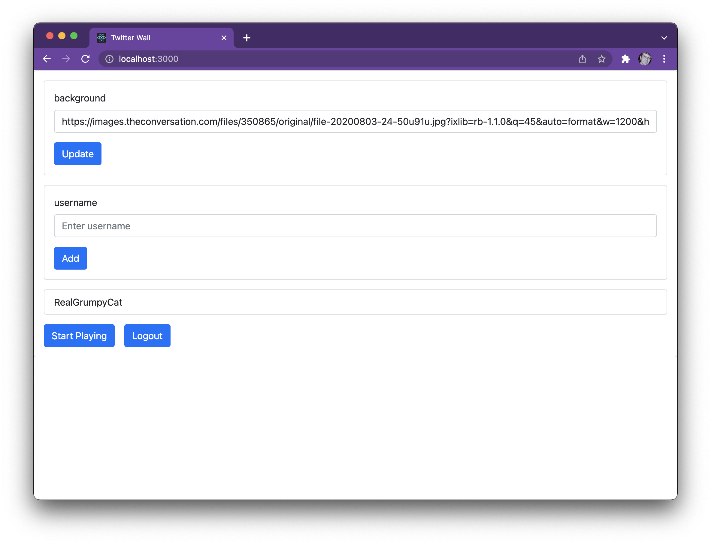
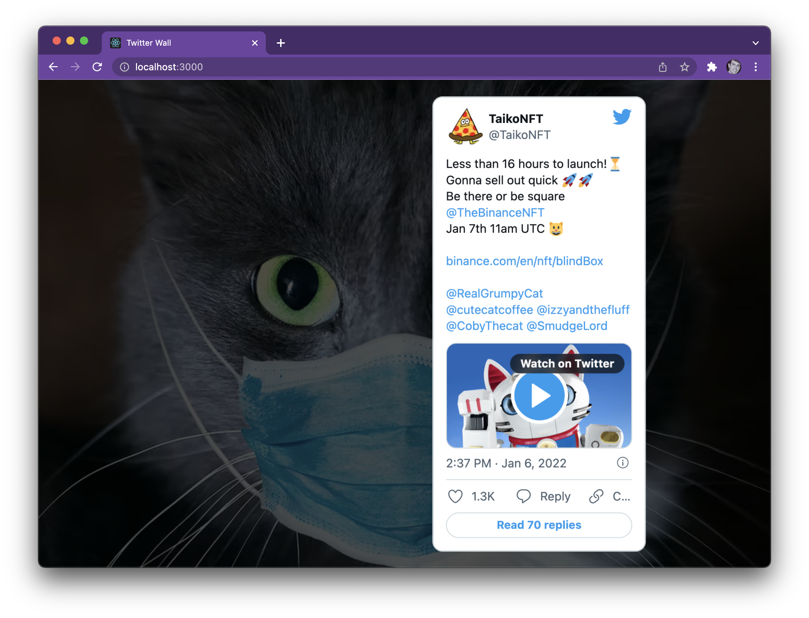

# twitter-wall

Twitter Wall is a simple client-only (mostly) web application that shows recent Tweets one at a time for one or more Users; designed for displaying on a television on a wall.

Once logged into a Twitter account, one provides an optional background image and one or more Twitter Users.



By pressing the *Start Playing* button, the application will display the optional background and loop through a randomized list of the ten most recent Tweets from the each of the provided Twitter Users; pausing 20 seconds between Tweets. Every 12 hours the list of Tweets is refreshed.



## Deployment

One must first decide on a way to [deploy a React web application](https://create-react-app.dev/docs/deployment); in particular one will need to know this web application's anticipated URL before proceeding.

As of this writing the [Twitter API does not support CORS headers](https://twittercommunity.com/t/will-twitter-api-support-cors-headers-soon/28276) and as such one must still route Twitter API calls through a backend server. This web application requires that one is running a [cors-anywhere](https://github.com/Rob--W/cors-anywhere) backend server; providing one with a CORS Anywhere endpoint URL. The article *[Fixing the CORS error by hosting your own proxy on Heroku](https://dev.to/imiebogodson/fixing-the-cors-error-by-hosting-your-own-proxy-on-heroku-3lcb)* provides a simple tutorial to accomplish this.

Then one signs up for a [Twitter Developer account](https://developer.twitter.com/en); creating a Project with an App. One will NOT need to copy the App's API Key, API Key Secret, or Bearer Token. One then sets up the App's Authentication with:

* OAuth 2.0
* Type of app: *Single page App*
* Callback URI / Redirect URL: the web application's anticipated URL 
* Website URL: any relevant URL will do

One will need to copy the Client ID.

Next one will need to clone / download this Repository to a workstation with [Node.js installed](https://nodejs.org/en/). One then runs the following command from the downloaded Repository (project) folder to install the project's dependencies.

```
$ npm install
```

One then adds [React environment variables using a *.env* file](https://create-react-app.dev/docs/adding-custom-environment-variables/#adding-development-environment-variables-in-env) with the following contents.

```
REACT_APP_AUTH_CLIENT_ID=[THE CLIENT ID]
REACT_APP_AUTH_CORS_ANYWHERE=[THE CORS ANYWHERE ENDPOINT URL]
REACT_APP_AUTH_REDIRECT_EP=[THE WEB APPLICATION'S ANTICIPATED URL]
```

One then deploys the React web application based on the way one decided. Finally, one opens the web application's URL in a browser and logs into it using a Twitter account; does NOT need to be the same account used for the Twitter Developer account.

## License

Copyright 2022 John Tucker

Permission is hereby granted, free of charge, to any person obtaining a copy of this software and associated documentation files (the "Software"), to deal in the Software without restriction, including without limitation the rights to use, copy, modify, merge, publish, distribute, sublicense, and/or sell copies of the Software, and to permit persons to whom the Software is furnished to do so, subject to the following conditions:

The above copyright notice and this permission notice shall be included in all copies or substantial portions of the Software.

THE SOFTWARE IS PROVIDED "AS IS", WITHOUT WARRANTY OF ANY KIND, EXPRESS OR IMPLIED, INCLUDING BUT NOT LIMITED TO THE WARRANTIES OF MERCHANTABILITY, FITNESS FOR A PARTICULAR PURPOSE AND NONINFRINGEMENT. IN NO EVENT SHALL THE AUTHORS OR COPYRIGHT HOLDERS BE LIABLE FOR ANY CLAIM, DAMAGES OR OTHER LIABILITY, WHETHER IN AN ACTION OF CONTRACT, TORT OR OTHERWISE, ARISING FROM, OUT OF OR IN CONNECTION WITH THE SOFTWARE OR THE USE OR OTHER DEALINGS IN THE SOFTWARE.
